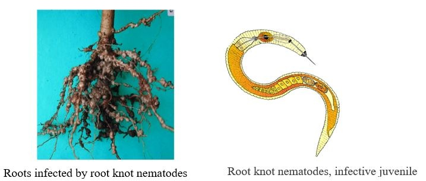

I am a PhD student in Applied Mathematics interesting on agroecology engineering for plant health protection, biology mathematical modeling, biological control and crop protection. I am conducting my research at Inria Sophia Antipolis working under the supervision of [Frédéric Grognard](http://www-sop.inria.fr/members/Frederic.Grognard), [Valentina Baldazzi](https://www.researchgate.net/profile/Valentina-Baldazzi) and [Suzanne Touzeau](https://www6.paca.inrae.fr/institut-sophia-agrobiotech_eng/Research-teams/M2P2/Team-members/TOUZEAU-Suzanne). My thesis is a joint project of two research centers namely Inria (National Institute for Research in Computer Science and Control) and INRAE (French National Institute for Agriculture, Food, and Environment ) where mathematics and biology are both applied.
 
My thesis aims to gain a better understanding of **differential plant susceptibility** by studying the complex interplay between **plants** and **population pest dynamics** while considering plant physiology and defense response. I exploit methods from dynamic system modelling to build a **mechanistic mathematical model** of plant-RKN (Root-Knot Nematodes) interactions that explicitly links plant physiology and pest demography, including both the effect of these pests on the crops and the effect of the plants on the pests.

Furthermore, I am also interested in (but don’t get to spend yet enough time on): biological control, biocontrol, theoretical ecology, artificial ecosystems, machine learning applications in agroecology.

## Professional

At the same time, I am hired as doctoral researcher by the center mentioned above to conduct this research by interacting with many researchers and colleagues and also participating in complementary experiments and data collection. For instance, Plant-Nematodes Interaction (IPN) team from INRAE which provides the necessary expertise, technical support as well as experimental facilities. In addition to my research, I devote part of my time to teaching certain modules in mathematics and computer science; more specifically mathematical analysis, data science.

   
