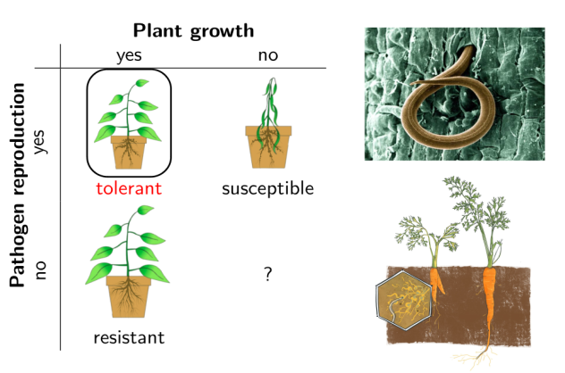
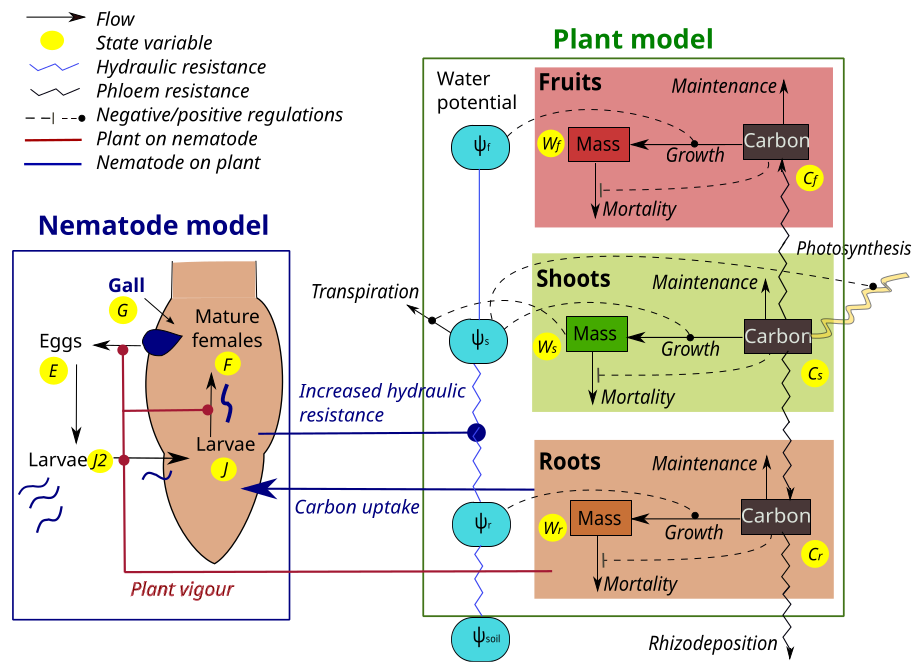

I am currently a Temporary Teaching and Research Assistant (ATER) at Polytech Nice Sophia. On February 6, 2026, I obtained my PhD in Information and Communication Sciences and Technologies from the Université Côte d’Azur (Nice, France), under the supervision of <a href="http://www-sop.inria.fr/members/Frederic.Grognard">Frédéric Grognard</a>, <a href="https://www.researchgate.net/profile/Valentina-Baldazzi">Valentina Baldazzi</a> and <a href="https://www6.paca.inrae.fr/institut-sophia-agrobiotech_eng/Research-teams/M2P2/Team-members/TOUZEAU-Suzanne">Suzanne Touzeau</a>. My research was conducted within the <a href="https://team.inria.fr/macbes/">Macbes</a> (Inria) and <a href="https://www6.paca.inrae.fr/institut-sophia-agrobiotech_eng/Research-teams/M2P2">ISA/M2P2</a> (INRAE) teams.

  

My <a href="https://theses.hal.science/tel-05599819">PhD work</a> focused on identifying the mechanisms underlying plant tolerance to parasitism by <b>Root-Knot Nematodes</b> (RKN) from the <i>Melodoigyne spp.</i> family. Tolerance refers to the ability of plants to withstand nematode infections while maintaining limited yield losses.

  

 
My CV can be found <a href="../files/CV_Joseph_Penlap_2026.pdf" class="uline">here</a>.
  
     
