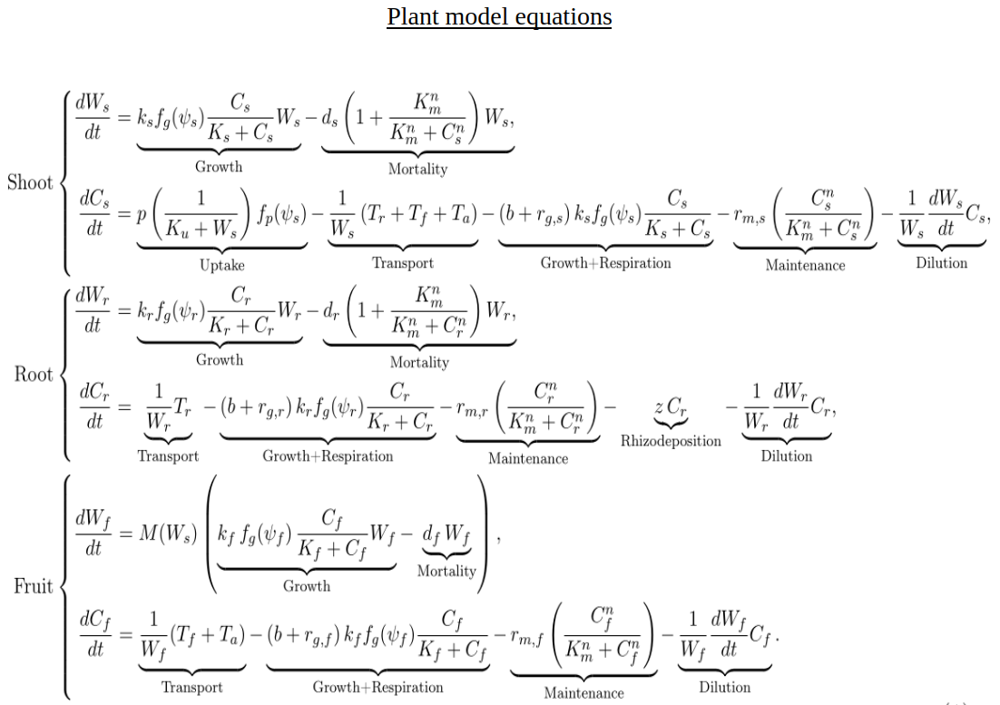
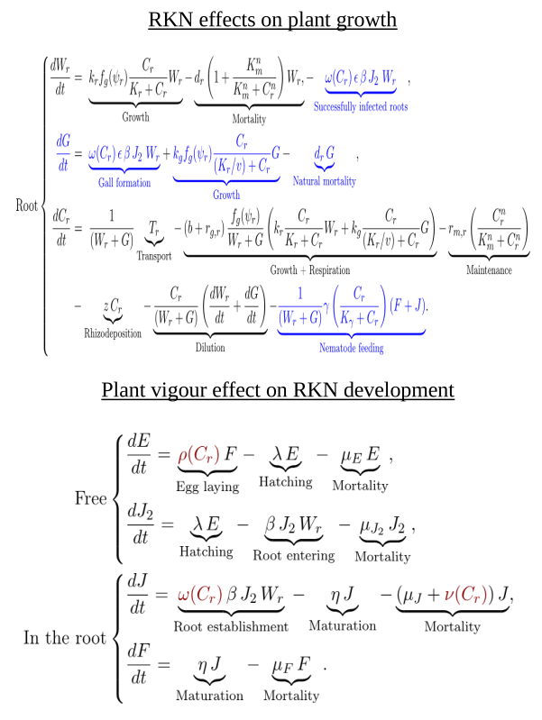

I am a third year PhD student in applied mathematics associated in both <a href="https://team.inria.fr/macbes/">Macbes</a> (Inria) and <a href="https://www6.paca.inrae.fr/institut-sophia-agrobiotech_eng/Research-teams/M2P2">ISA/M2P2</a> (INRAE) teams working under the supervision of <a href="http://www-sop.inria.fr/members/Frederic.Grognard">Frédéric Grognard</a>, <a href="https://www.researchgate.net/profile/Valentina-Baldazzi">Valentina Baldazzi</a> and <a href="https://www6.paca.inrae.fr/institut-sophia-agrobiotech_eng/Research-teams/M2P2/Team-members/TOUZEAU-Suzanne">Suzanne Touzeau</a>. My team and I develop theoretical models and experiments to improve existing or infer new plant protection methods using both mathematics and biological tools.

My research aims at gaining a better understanding of <b>differential plant susceptibility</b> to parasitism by <b>Root-Knot Nematodes</b> (RKN) from the <i>Melodoigyne spp.</i> family. This study focuses on the case of tolerant plants, which are plants able to cope with nematode infections with limited yield losses.

  

Understanding the mechanisms of plant tolerance is a key challenge to design, improve and assess control strategies that both maintain the yield and reduce long-term soil infestation. I exploit methods from dynamic system modelling to build a <b>mechanistic mathematical model</b> of plant-RKN interactions that explicitly links plant physiology and pest demography, including both the effect of these pests on the crops and the effect of the plants on the pests.

    

I'm also interested (but don't yet spend enough time on) in biocontrol, biological control and fast-slow processes in plant growth.

In addition to research, I devote part of my time to teaching certain mathematics and computer science modules, namely linear algebra and mathematical analysis to undergraduate students.

     
